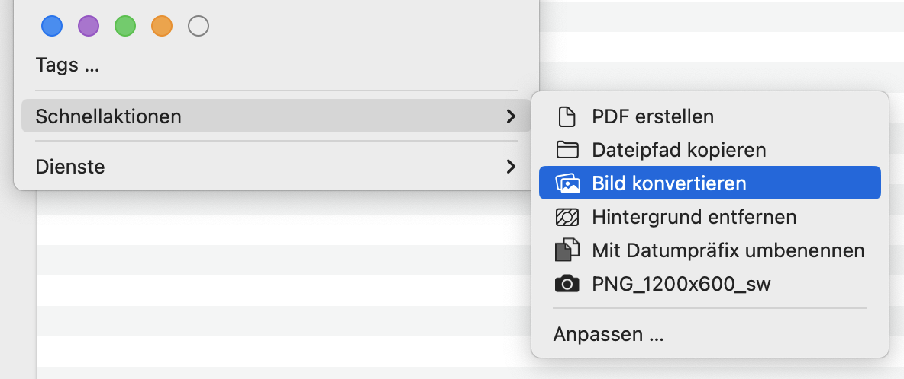
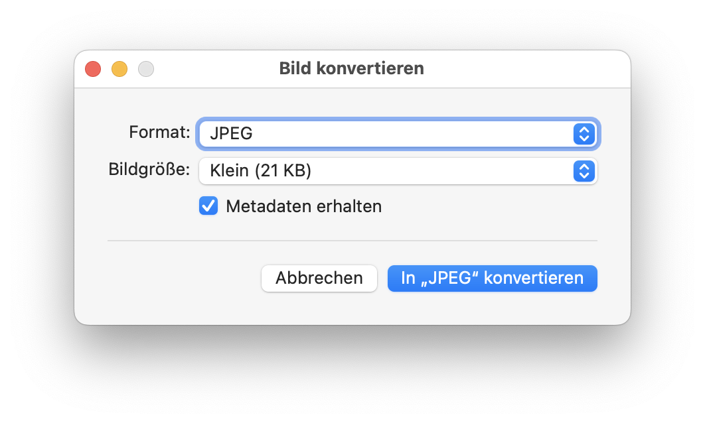
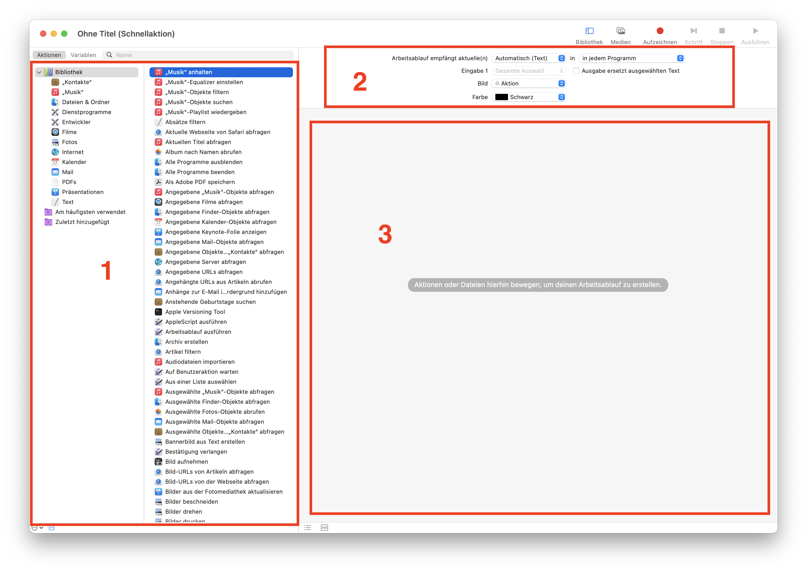
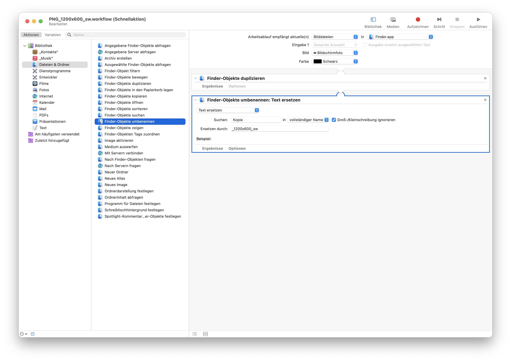
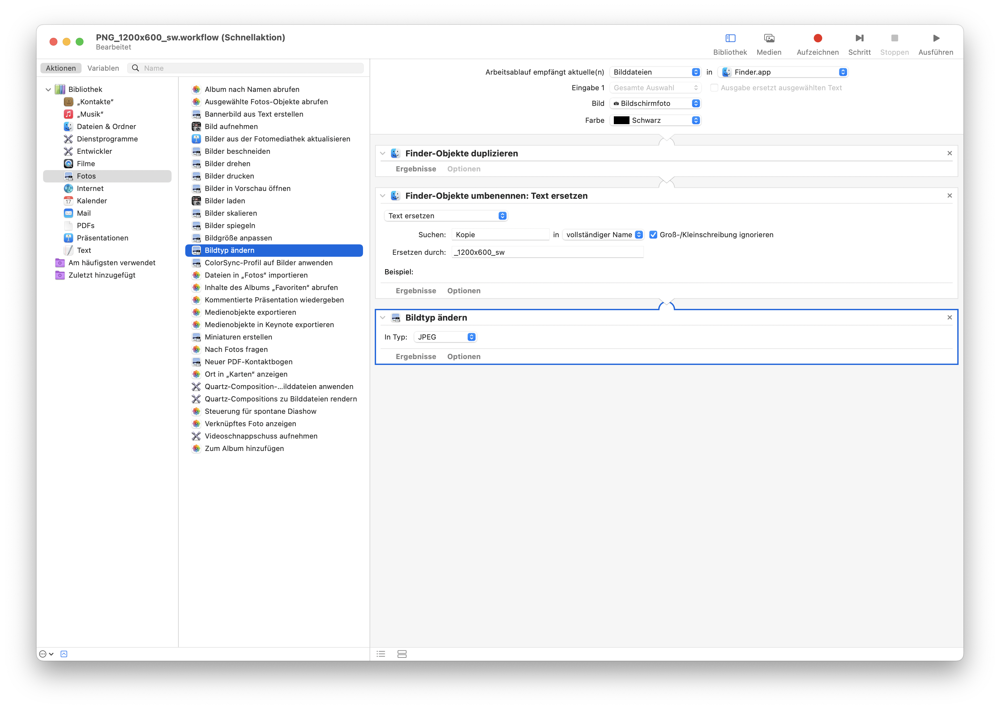
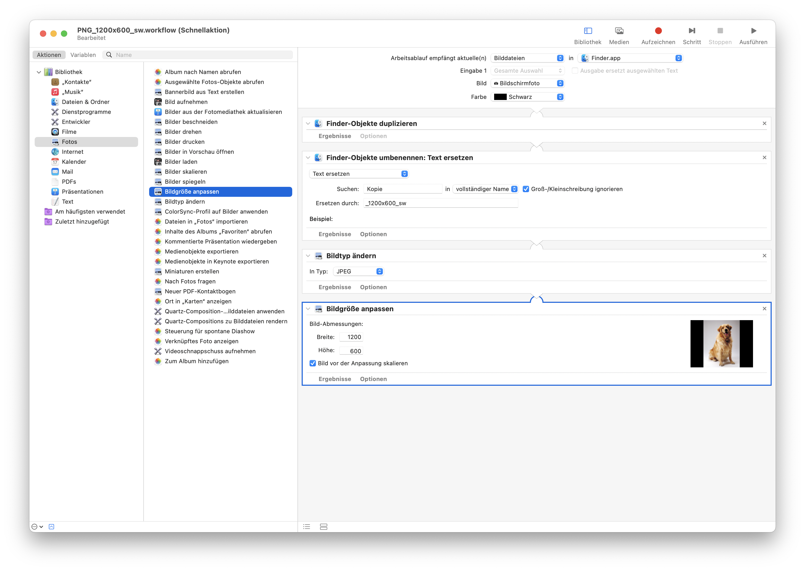
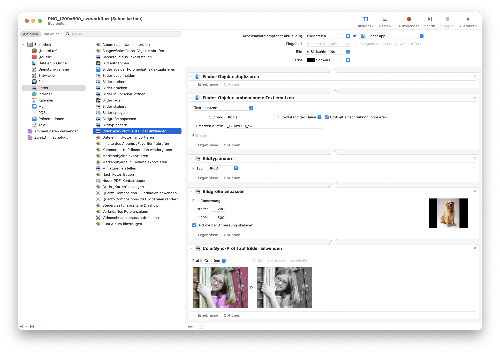

Bildformate wie `HEIC` und `WebP` werden von vielen Applikationen noch nicht unterstützt. Daher ergeben sich immer wieder Situationen in denen man Bilder in ein `JPEG` oder `PNG` umwandeln muss. 

Im Finder von MacOS lässt sich das ganz schnell und einfach bewerkstelligen. Mit der Standard-App [Automator](https://support.apple.com/de-ch/guide/automator/welcome/mac) lassen sich zudem einfache Bildanpassungen automatisiert mit einem Mausklick anwenden.

## Was sind WebP Bilder?

`WebP` ist ein Bildformat, dass aufgrund seiner besseren Komprimierung gegenüber seiner Konkurrenz glänzt. Web-Performance – also das schnelle Laden von Webseiten – ist ein wichtiges Kriterium für den Erfolg und der Suchmaschinenoptimierung. Daher wird das Format im Web vermehrt eingesetzt.

## iPhone Fotos im `HEIC`-Format

Seit iOS 11 werden Fotos standardmässig mit der Dateiendung `.heic` gespeichert, sofern dies in den Einstellungen nicht angepasst wird. Gegenüber dem `JPEG` nimmt es weniger Speicher in Anspruch. Durch die neue Standardeinstellung hat das Format rasch an Beliebtheit gewonnen. In MacOS wird eine Schnellaktion mitgeliefert, welche das Umwandeln per Mausklick im Finder ermöglicht, mehr dazu weiter unten.

### HEIC, HEIF, HEVC

HEIC steht für High-Efficiency Image Container. Es sind HEIF-Bilder (High Efficiency Image File Format), welche mit HEVC (High Efficiency Video Coding) codiert sind. Nähere Informationen bietet der Wikipedia-Artikel [High Efficiency Image File Format](https://en.wikipedia.org/wiki/High_Efficiency_Image_File_Format).

### Standardformat in iOS umstellen

Möchte man generell auf das neuere Format verzichten, kann dies in den iOS-Einstellungen geändert werden:

1. Wähle «Einstellungen» → «Kamera» → «Formate»
2. Wechsle die Option in «Maximale Kompatibilität»

## Umwandlung mittels Schnellaktion

Mehrere `HEIC` oder `WebP` Bilder können im Finder ausgewählt und mit einem Rechtsklick auf «Schnellaktionen» → «Bild konvertieren» in ein anderes Format geändert werden.

In einem zweiten Dialog kann dann das Format 

- `JPEG`
- `PNG`
- `HEIC`

ausgewählt werden. Zudem muss man sich für eine der vordefinierten Bildgrössen entscheiden.

## Eine eigene Schnellaktion in Automator anlegen

Mit Automator können Abläufe automatisiert werden. Wir schauen uns hier die Erstellung einer eigenen Schnellaktion an. Nach dem Speichern wird diese dann ebenfalls via Rechtsklick → «Schnellaktionen» verfügbar sein.

1. Öffne Automator und wähle «Ablage» → «Neu»
2. Wähle als Typ «Schnellaktion» aus
3. Auf der linken Seite ist deine Bibliothek mit Aktionen und auf der rechten Seite ein noch leerer Workflow

## Beispiel eines Bildworkflows

Um aufzuzeigen was mit Automator umgesetzt werden kann, kreieren wir eine Schnellaktion, die zuerst eine Kopie der ausgewählten Bilder anlegt. Die Kopien werden dann in ein `JPEG` umgewandelt und generell die Grösse in 1200 × 600 px angewendet. Zum Schluss werden die Farben noch in Graustufen geändert.

Was jetzt noch fehlt sind die generellen Einstellungen deines Workflows. Diese findest oberhalb, siehe Bereich 2 im Screenshot oben mit den roten Markierungen. Damit die Schnellaktion bei Bildern erscheint muss im ersten Dropdown auf «Bilddateien» und in «Finder» gewechselt werden. Die beiden unteren Dropdown-Felder steuern das Aussehen des Befehls innerhalb des Menüs «Schnellaktionen» und sind optional.

## Automatische Bildbearbeitung für den professionellen Einsatz

Die Möglichkeiten in Automator sind auf einfache Anpassungen beschränkt. Pixometry ist eine Applikation, die Bilder mithilfe von künstlicher Intelligenz automatisch optimiert und erweiterte Bildworkflow-Möglichkeiten beherrscht. Weitere Infos zum Produkt und Kontaktmöglichkeiten zur Beratung sind auf der [a&f Website](https://www.a-f.ch/produkte/pixometry/) zu finden.

<small>Quelle Artikelbild: DALL·E generiertes Bild (mit Text ergänzt).</small>