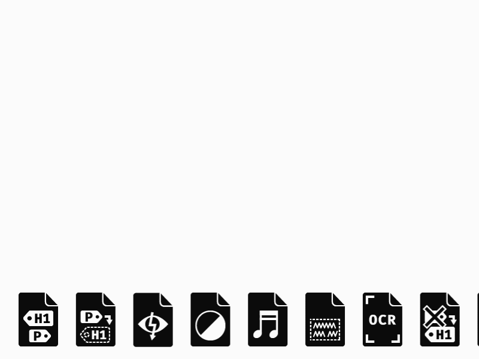

Eigentlich war die Idee, diese Icons auf [[projects/accessible-pdf-info|accessible-pdf.info]] zu verwenden, dies habe ich dann aber wieder verworfen.

Mithilfe des Matterhorn Protokoll kann ein PDF-Dokument ob es PDF/UA konform ist. PDF/UA ist eine PDF-Spezifikation und ISO-Standard, welcher definiert was es benötigt damit ein PDF als barrierefrei und zugänglich gilt.

[Icons «Matterhorn Protokoll» herunterladen](https://github.com/stebrech/icons-matterhorn-protocol)

[Icons «Matterhorn Protokoll» auf Dribbble](https://dribbble.com/shots/4710628-Icons-Matterhorn-Protocol)
