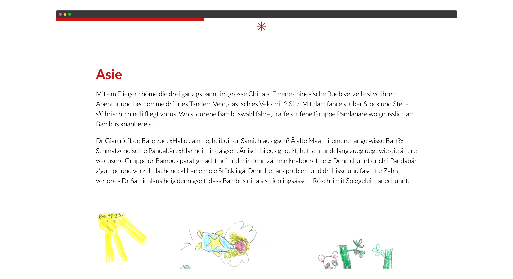
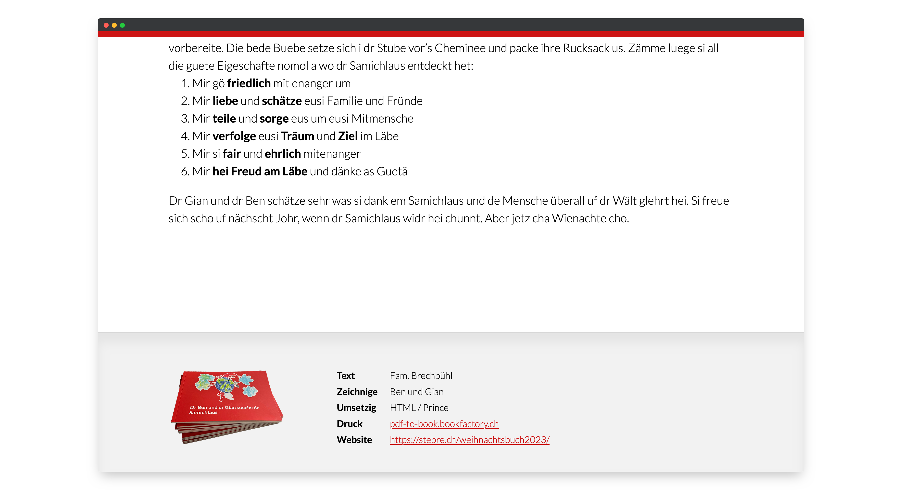

## Idee

Als Weihnachtsgeschenk haben wir uns dieses Jahr eine Weihnachtsgeschichte ausgedacht. Die Geschichte «Dr Ben und dr Gian sueche dr Samichlaus» wurde mit Zeichnungen unserer beiden Söhne geschmückt. 

Ziel war eine *Content First* gerechte Umsetzung, so dass eine einzige Datengrundlage sowohl für ein gedrucktes Buch wie auch eine Webseite genutzt werden kann. Die Inhalte sind in Markdown – also reinen Textfiles – geschrieben.

## Prince

Mit den erstellten Markdown-Files hätte ich das Buch in InDesign oder einem anderen Layoutprogramm umsetzen können, sowie ich das vor einer Weile mal in [[../blog/crossmediale-textverarbeitung-mit-markdown|Crossmediale Textverarbeitung mit Markdown]] niedergeschrieben habe. 

Ich wollte es jedoch mit dem PDF Renderer [Prince](https://www.princexml.com/) bewerkstelligen – auch wenn ich damit um ein vielfaches mehr Zeit aufwenden musste 😅. Nebst dem ich mich tiefer damit auseinandersetzen wollte und davon lernen wollte, war die Idee eine Grundlage für künftige Projekte zu schaffen. Die Stärke von PrintCSS zeigt sich bei Wiederholungen und standardisierten Ausgaben.

## md-book-with-docraptor

Obwohl ich den Inhalt und das Cover schlussendlich mit dem lokal installierten Prince gerendert habe, entstanden mit diesem Buch zwei Node.js-Skripte, die ich im Repository [md-book-with-docraptor](https://github.com/stebrech/md-book-with-docraptor) auf Github zur Verfügung stelle. 

Die beiden Skripte werde ich hier nicht im Detail beschreiben. Kurz gesagt wandelt `md2html.js` die Markdown-Files in mehrere HTML-Dateien um und `docraptor.js` sendet die HTML-Dateien, welche den CSS-Code und Assets inline enthalten, an [docraptor.com](https://docraptor.com/). DocRaptor ist ein Onlineservice mit einer API um Prince in der Cloud zu nutzen.

## Web-Ausleitung

Mit dem Layouten mithilfe von CSS muss natürlich auch eine bildschirmoptimierte Version in Form einer Webseite her. Mit den erstellten HTML-Files wird sowohl die Print- wie auch die Web-Ausleitung erreicht. Der Unterschied machen die CSS-Regeln. Mit dem Einsatz von CSS-Variablen lässt sich das Endergebnis individuell gestalten. So können im 1. Teil von `general.css` die Seitengeometrien, Anschnitt, Farben, Schriften, etc. festgelegt werden.

Die Webseite startet mit einer bildschirmfüllenden Titelbereich mit dem Coverbild als Hintergrund.

Zwischen den einzelnen Kapiteln kann ein Separatorzeichen gewählt werden. Ich habe die Stern-Glyphe gewählt. Während dem Scrollen wird der Fortschritt mit einem Balken oben in der Akzentfarbe angezeigt.

Das Impressum, welches im Buch zu Begin im Inhaltsteil erscheint, wird auf der Webseite im Fussbereich angezeigt.

