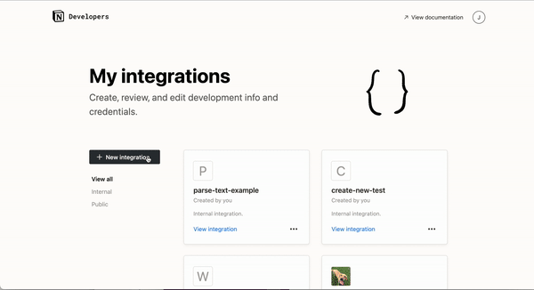
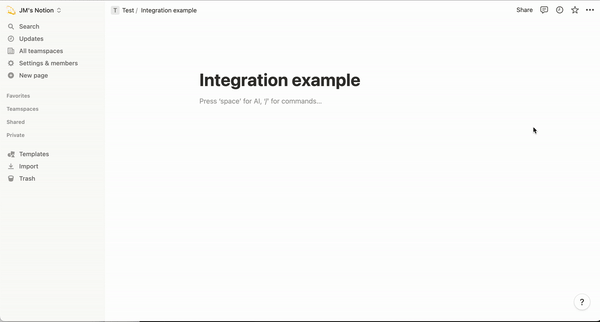

> [!info] Update 2.2.2024
> For stebre.ch I now use [Obsidian](https://obsidian.md/) to create and manage the content. Since I continue to use the Notion interface for création eliane, [[en/projects/familienverein-wahlen|Familienverein Wahlen]] and hopefully soon for other exciting projects, I will continue to maintain it. With [[en/projects/notion2eleventy|notion2eleventy]] I have built a more configurable 11ty plugin.

## What is 11ty?

[11ty](https://www.11ty.dev/) (also called Eleventy) is one of many Static Site Generators (short: SSG), powered by [Node.js](https://nodejs.org). An SSG is responsible for the actual output (front end) of a website/web app and is deliberately separated from the content administration (back end).

With 11ty, results can already be achieved with very little code, so it is minimalistic but highly configurable. From the ground up, it runs with few Node.js dependencies and is one of the fastest when it comes to generating the website (build time). The many possible template languages are also a big advantage. I use a combination of Markdown and Nunjucks.

The following YouTube video from [11ty Rocks!](https://11ty.rocks/) shows a three-minute setup with 11ty: [Build an 11ty Site in 3 Minutes](https://www.youtube.com/watch?v=BKdQEXqfFA0)

## What is Notion?

[Notion](https://www.notion.so/) is a cloud tool and lets you write content in a block editor (similar to WordPress' Gutenberg editor). The content can be easily structured in databases. The addition of metadata and the different display formats make the content tool very versatile. And with Notion's API, it can also be used as a headless CMS.

## How I brought the two together

As already mentioned, Notion offers an API to use the content in other ways. To do this, you can create your own integration at [https://www.notion.so/my-integrations](https://www.notion.so/my-integrations). An API key will be generated and the authorizations are defined.



*Image source: [notion.so](https://developers.notion.com/docs/create-a-notion-integration)*

In Notion, the integration can now be added to a database, for example a blog.



*Image source: [notion.so](https://developers.notion.com/docs/create-a-notion-integration)*

This completes the part in Notion. Let's continue with the more complex part in the 11ty project.

### Required Node.js packages

To use the Notion API, the Node package [`notionhq/client`](https://www.npmjs.com/package/@notionhq/client) is required.

I wanted to have the content within the 11ty repository and download it as Markdown files. This way I also have a backup for my content. To achieve this, I need another node package: [`notion-to-md`](https://www.npmjs.com/package/notion-to-md).

### fetchContent.js

> [!info] Update 2.2.2024
> The code shown below is partially outdated. With [[en/projects/notion2eleventy|notion2eleventy]] I have transferred it to a node package.

I have configured how the Markdown files should be downloaded and filled in a new JavaScript file (`fetchContent.js`).
s
The first function queries one of the databases and filters it using the "Status" metadata field. So I don't want to download everything every time, but only what is in one (or in an optional second) status. This keeps the time required manageable.

```javascript
// Get all posts with status defined as environment variable
async function filteredRequest(dbPostType) {
	try {
		const response = await notion.databases.query({
			database_id: dbPostType,
			filter: {
				or: [
					{
						property: "Status",
						select: { equals: process.env.CHECKSTATUS },
					},
					{
						property: "Status",
						select: { equals: process.env.CHECKSTATUS2 },
					},
				],
			},
		});
		return response.results;
	} catch (error) {
		console.error("Error in the filteredRequest function:", error.message);
	}
}
```

In the second function, an array is created which contains an object with the required metadata for each hit. As there are many identical metadata types in the various databases, all metadata is available and covered within one function.

```javascript
// Create an array for each post type
async function createArray(dbId) {
	try {
		const filteredData = await filteredRequest(dbId);
		const results = filteredData.map((result) => ({
			id: result.id,
			title: result.properties["Name"]?.title?.map((text) => text.plain_text).join(""),
			tags: result.properties["Tags"]?.multi_select.map((tag) => tag.name),
			featuredImage: result.cover?.file?.url || result.cover?.external?.url,
			date: result.properties["Date"]?.date?.start.split("T")[0],
			updated: result.properties["Updated"]?.date?.start.split("T")[0],
			description: result.properties["Description"]?.rich_text
				.map((text) => text.plain_text)
				.join(""),
			permalink: result.properties["URL"]?.url,
			featured: result.properties["Homepage"]?.checkbox,
			weblink: result.properties["Weblink"]?.url,
			content: undefined,
		}));
		return results;
	} catch (error) {
		// Handle errors here
		console.error("Error in the getArray function:", error.message);
	}
}
```

Two helper functions are used to convert possible umlauts and accents.

```javascript
// Functions to replace special characters
function matchUmlauts(match) {
	switch (match) {
		case "ä":
			return "ae";
		case "ö":
			return "oe";
		case "ü":
			return "ue";
	}
}

function matchAccents(match) {
	switch (match) {
		case "ç":
			return "c";
		case "é" || "è" || "ê" || "ë":
			return "e";
		case "à" || "â":
			return "a";
		case "ù" || "û":
			return "u";
		case "î" || "ï":
			return "i";
		case "ô":
			return "o";
	}
}
```

Now `notion-to-md` comes into play. The content is filled within the created array in the previously undefined object property `content`. This takes place in a `for` loop, as the array can consist of several objects.

```javascript
// Get content from Notion
const getContent = async (id) => {
	try {
		const mdblocks = await n2m.pageToMarkdown(id);
		return n2m.toMarkdownString(mdblocks);
	} catch (error) {
		// Handle errors here
		console.error("Error in the getContent function:", error.message);
	}
};

// Create content
async function createMarkdownFiles(dbId, postType, postTypes) {
	try {
		const arr = await createArray(dbId);
		for (i = 0; i < arr.length; i++) {
			arr[i].content = await getContent(arr[i].id);
…
```

Within the `for` loop, we continue with variables that are required for saving and naming the Markdown files, as well as for the URL path.

```javascript
…
			let titleSlug = arr[i].title
				.toLowerCase()
				.replace(/[\s/]/gi, "-")
				.replace(/[äöü]/gi, matchUmlauts)
				.replace(/[çéèêëàâùûîïô]/gi, matchAccents)
				.replace(/[^a-z0-9-]/gi, "");

			let filename = "";
			if (arr[i].date) {
				filename = arr[i].date.replace(/[-]/gi, "") + "_" + titleSlug + ".md";
			} else {
				filename = titleSlug + ".md";
			}

			let file = "src/" + postTypes + "/" + filename;

			let urlPath = "";
			if (postType === "post") {
				urlPath =
					postTypes +
					"/" +
					arr[i].date.match(/\d{4}/g) +
					"/" +
					arr[i].date.match(/(?<=-)\d{2}(?=-)/g) +
					"/" +
					titleSlug +
					"/";
			} else if (postType === "project") {
				urlPath = postTypes + "/" + titleSlug + "/";
			} else {
				urlPath = titleSlug + "/";
			}
…
```

The frontmatter, i.e. the metadata at the beginning of the Markdown file, is then compiled and combined with the content in the `content` and the `mdContent` variable. In addition, superfluous empty lines are removed and consecutive images are grouped in a div container. This container with the class `imagesContainer` can be used to display the images in a gallery.

```javascript
…
			// Add frontmatter
			let frontmatter = "---\n";
			frontmatter += 'title: "' + arr[i].title + '"\n';
			frontmatter += 'layout: "' + postType + '.njk"\n';
			if (arr[i].date) {
				frontmatter += "date: " + arr[i].date + "\n";
			}
			if (arr[i].updated) {
				frontmatter += "updated: " + arr[i].updated + "\n";
			}
			if (arr[i].featuredImage) {
				frontmatter += 'featuredImage: "' + arr[i].featuredImage + '"\n';
			}
			if (arr[i].description) {
				frontmatter += 'description: "' + arr[i].description + '"\n';
			}
			if (arr[i].tags) {
				frontmatter += "tags: [" + arr[i].tags + "]\n";
			}
			if (arr[i].featured !== undefined) {
				frontmatter += "featured: " + arr[i].featured + "\n";
			}
			if (arr[i].weblink) {
				frontmatter += 'weblink: "' + arr[i].weblink + '"\n';
			}
			frontmatter += 'permalink: "' + urlPath + '"\n';
			frontmatter += "---\n";

			let mdContent = frontmatter + arr[i].content.parent;
			// Add content and remove double line breaks and line breaks between images
			mdContent = mdContent.replace(/\n{3,}/g, "\n\n");
			// Add a div container around images
			mdContent = mdContent.replace(
				/!\[.*?\]\(.*?\)(?:\n\s*!?\[.*?\]\(.*?\))+/g,
				`<div class="imagesContainer">\n\n$&\n\n</div>`
			);
…
```

I want to have assets such as images, PDFs and movies saved in the 11ty repository as well. The assets are only accessible with a temporary public URL from the AWS cloud anyway.

The images are easy to distinguish from the other asset types (PDFs and movies) due to the Markdown syntax (``). However, it is more difficult to distinguish whether the asset has been uploaded to Notion or is it in a different location, for example a PDF that I link to. I have now solved this so that the URL must contain `amazonaws`.

```javascript
…
			// Download images from Notion and replace URL in markdown file
			let images = mdContent.match(
				/(?<=featuredImage:\s\")https?:\/\/.*(amazonaws).*(?=\")|(?<=\!\[.*\]\()https?:\/\/.*(amazonaws).*(?<!\))/g
			);

			if (images) {
				for (j = 0; j < images.length; j++) {
					let imgUrl = images[j];
					let imgFiletype = imgUrl.match(/(?<=\.)[a-z]+(?=\?)/g);
					let imgRenamed = "";
					if (arr[i].date) {
						imgRenamed =
							arr[i].date.replace(/[-]/gi, "") + "_" + titleSlug + "_" + j + "." + imgFiletype;
					} else {
						imgRenamed = titleSlug + "_" + j + "." + imgFiletype;
					}
					let imgPath = "src/assets/img/" + imgRenamed;
					download(imgUrl, "src/assets/img/", { filename: imgRenamed });
					mdContent = mdContent.replace(imgUrl, imgPath);
				}
			}

			// Download pdfs from Notion and replace URL in markdown file
			let pdfs = mdContent.match(/(?<=\[.*\]\()https?:\/\/.*(amazonaws).*(\.pdf).*(?<!\))/g);
			if (pdfs) {
				for (j = 0; j < pdfs.length; j++) {
					let pdfUrl = pdfs[j];
					let pdfFilename = pdfUrl.match(/(?<=\/)[^\/]+(?=\?)/g);
					pdfFilename = pdfFilename.toString();
					let pdfOutput = "src/assets/pdf/";
					let pdfPath = "/assets/pdf/";
					pdfPath = pdfPath.concat(pdfFilename);
					await download(pdfUrl, pdfOutput, { filename: pdfFilename });
					mdContent = mdContent.replace(pdfUrl, pdfPath);
				}
			}

			// Download movies from Notion and replace URL in markdown file
			let movies = mdContent.match(
				/(?<=\[.*\]\()https?:\/\/.*(amazonaws).*(\.mov|\.mp4).*(?<!\))/g
			);
			if (movies) {
				for (j = 0; j < movies.length; j++) {
					let movieUrl = movies[j];
					let movieFilename = movieUrl.match(/(?<=\/)[^\/]+(?=\?)/g);
					movieFilename = movieFilename.toString();
					let movieOutput = "src/assets/movies/";
					let moviePath = "/assets/movies/";
					moviePath = moviePath.concat(movieFilename);
					await download(movieUrl, movieOutput, { filename: movieFilename });
					mdContent = mdContent.replace(movieUrl, moviePath);
				}
			}
…
```

Finally, the Markdown file is written and the status is changed in Notion.

```javascript
…
			// Write markdown files
			fs.writeFile(file, mdContent, (err) => {
				if (err) {
					console.log(err);
				} else {
					console.log(filename + " has been written successfully");
				}
			});

			// Update status defined as environment variable
			notion.pages.update({
				page_id: arr[i].id,
				properties: {
					status: {
						select: {
							name: process.env.UPDATESTATUS,
						},
					},
					URL: {
						url: urlPath,
					},
				},
			});
		}
		// If no new posts are found, log this
		if (arr.length === 0) {
			console.log("No updates in " + postTypes);
		}
	} catch (error) {
		// Handle errors here
		console.error("Error in the createMarkdownFiles function:", error.message);
	}
}
```

~~The complete `fetchContent.js` is available in the Github repository [stebrech/stebre-site](https://github.com/stebrech/stebre-site). I am happy if you report an improvement suggestion or bug there.~~

The blog post [From Notion to Eleventy](https://iamschulz.com/from-notion-to-eleventy/) by Daniel Schulz helped me with the implementation and I also had to ask ChatGPT for advice from time to time ;-)

