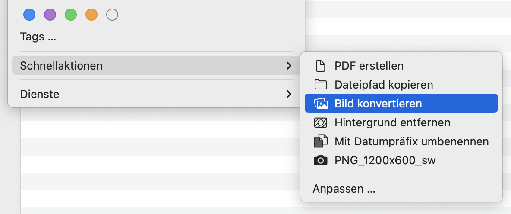
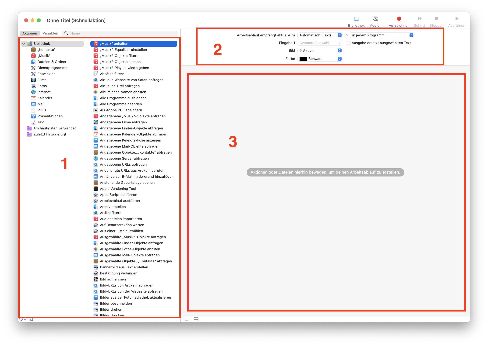
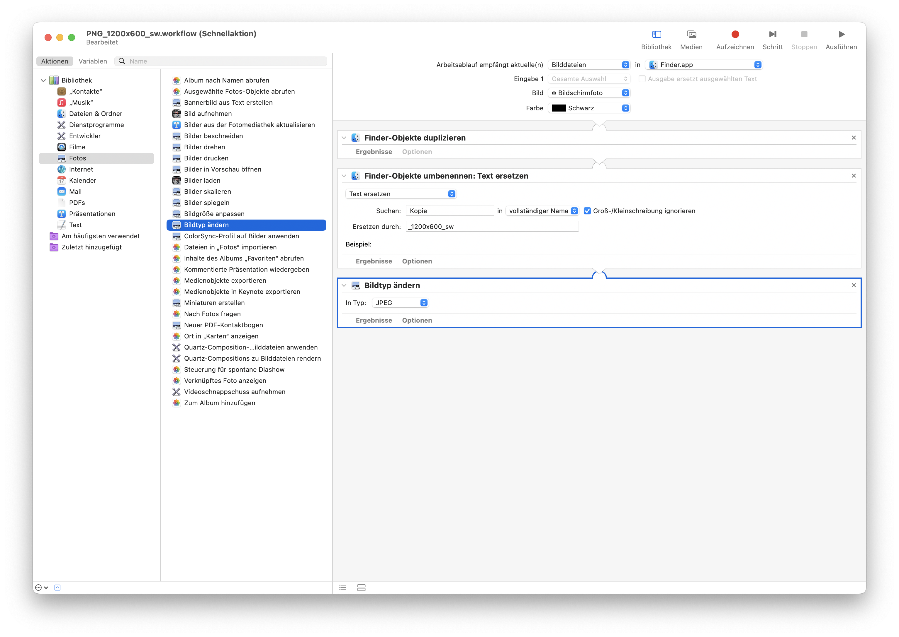
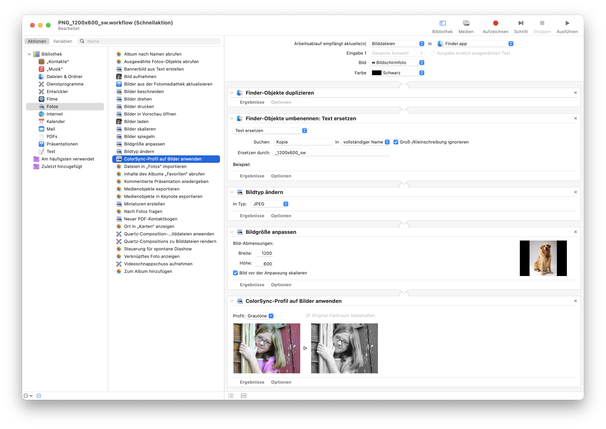

This can be done quickly and easily in the MacOS Finder. With the standard app [Automator](https://support.apple.com/en-us/guide/automator/welcome/mac), simple image adjustments can also be applied automatically with a click of the mouse.

## What are WebP images?

`WebP` is an image format that stands out from its competitors due to its better compression. Web performance – i.e. the fast loading of websites – is an important criterion for success and search engine optimization. This is why the format is increasingly being used on the web.

## iPhone photos in `HEIC` format

Since iOS 11, photos are saved with the file extension `.heic` by default, unless this is adjusted in the settings. Compared to `JPEG`, it takes up less memory. The format has rapidly gained popularity due to the new default setting. MacOS comes with a quick action that enables conversion with a mouse click in the Finder, more on this below.

### HEIC, HEIF, HEVC

HEIC stands for High-Efficiency Image Container. These are HEIF images (High Efficiency Image File Format), which are encoded with HEVC (High Efficiency Video Coding). Further information can be found in the Wikipedia article [High Efficiency Image File Format](https://en.wikipedia.org/wiki/High_Efficiency_Image_File_Format).

### Change standard format in iOS

If you generally want to do without the newer format, this can be changed in the iOS settings:

1. Select `Settings` → `Camera` → `Formats`
2. Change the option to `Maximum compatibility`

## Conversion using quick action

Several `HEIC` or `WebP` images can be selected in the Finder and changed to another format by right-clicking on “Quick actions” → “Convert image”.

In a second dialog, the format

- `JPEG`
- `PNG`
- `HEIC`

can be selected. You must also choose one of the predefined image sizes.

## Create your own quick action in Automator

Automator can be used to automate processes. Here we take a look at how to create your own quick action. After saving, this will also be available via right-click → `Quick actions`.

1. Open Automator and select `File` → `New`
2. Select `Quick action` as the type
3. On the left side is your library with actions and on the right side a still empty workflow

## Example of an image workflow

To show what can be done with Automator, we create a quick action that first creates a copy of the selected images.

The copies are then converted into a `JPEG` …

and the size is generally applied in 1200 × 600 px.

Finally, the colors are changed to grayscale.

What is still missing are the general settings for your workflow. These can be found above, see area 2 in the screenshot above with the red markings. In order for the quick action to appear for images, you must switch to `Image files` and `Finder` in the first dropdown. The two lower drop-down fields control the appearance of the command within the `Quick actions` menu and are optional.

## Automatic image processing for professional use

The possibilities in Automator are limited to simple adjustments. Pixometry is an application that automatically optimizes images using artificial intelligence and masters advanced image workflow options. Further information about the product and contact options for advice can be found on the [a&f website](https://www.a-f.ch/produkte/pixometry/).

Source article image: DALL-E generated image (with text added).
