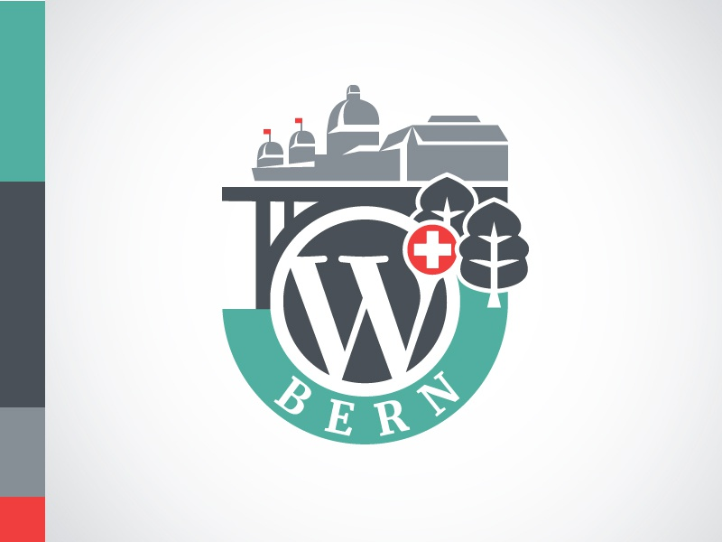
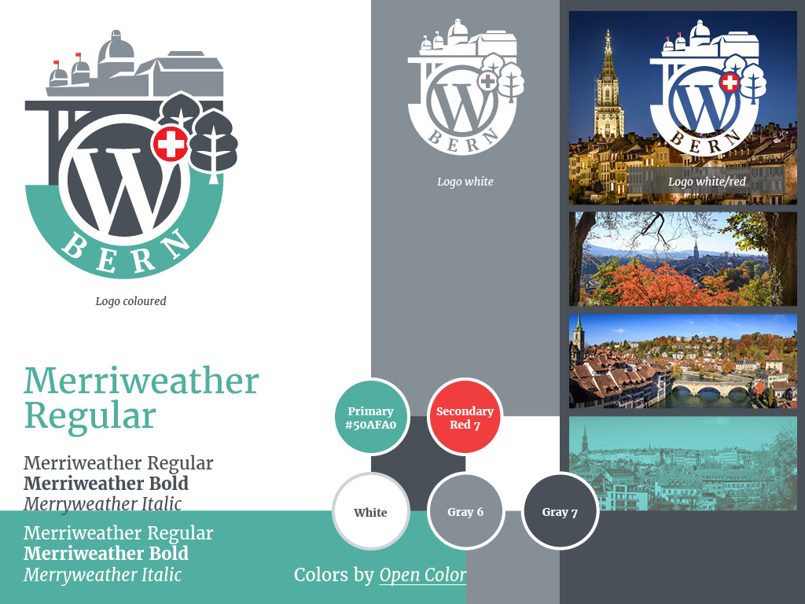
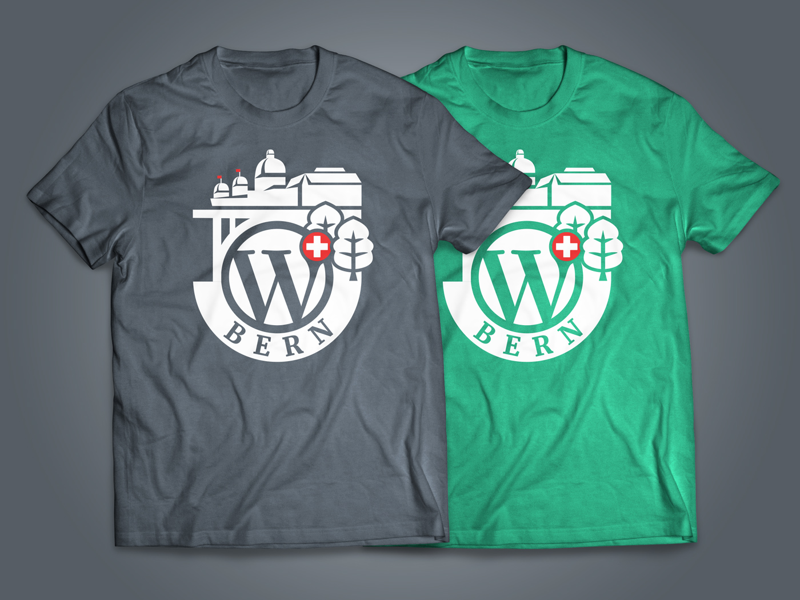
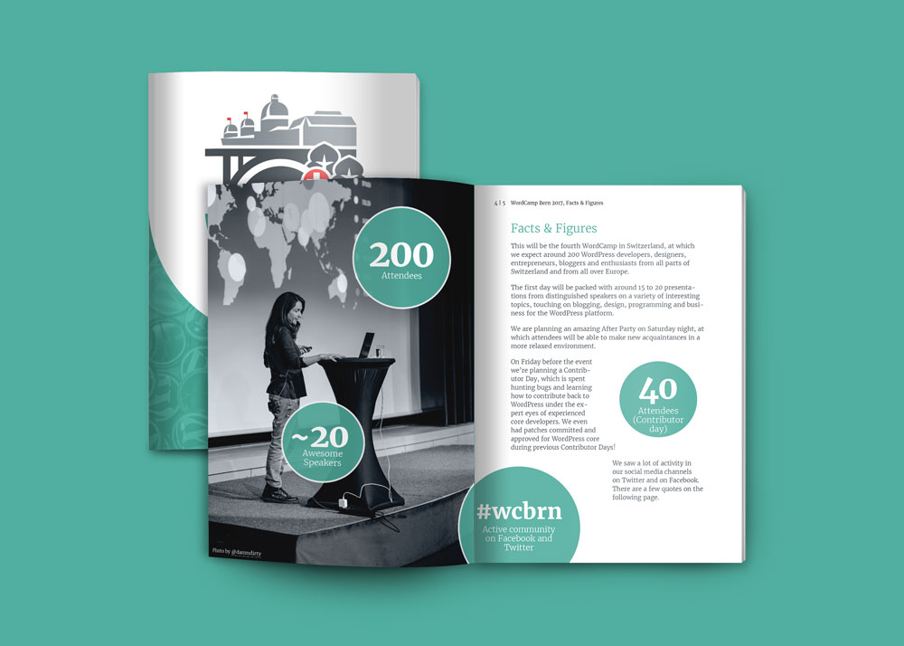
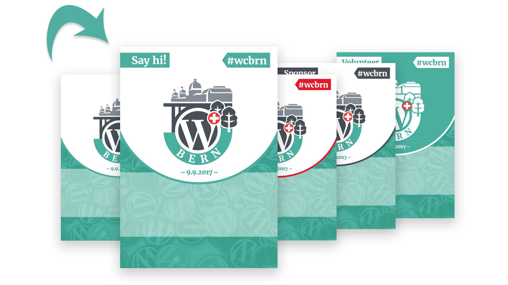
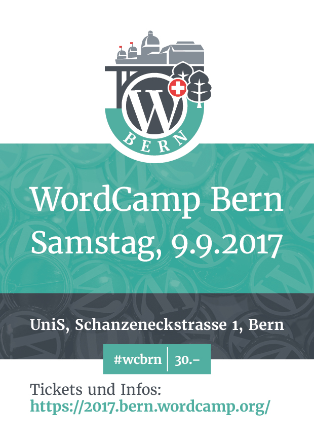
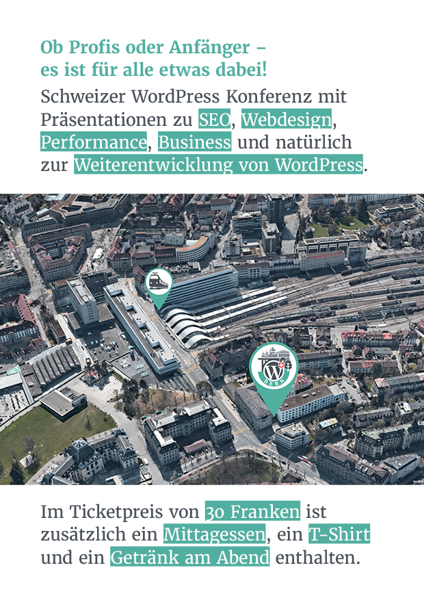

---
aliases:
  - WordCamp Bern 2017 Design
  - WordCamp Bern 2017
title: WordCamp Bern 2017 Design
date: 2017-09-09T00:00:00.000Z
featuredImage: ../../assets/img/20170909_wordcamp-bern-2017-design.jpg
description: >-
  On 9.9.2017 the WordPress event took place in Bern. These events are called
  WordCamp and take place worldwide with the open source community. I was part
  of the organizing team and was allowed to design the logo, t-shirts, batches
  and more.
tags:
  - branding
  - print
featured: false
weblink: 'https://bern.wordcamp.org/2017/'
status: done
---
## Logo design

[Dribbble Shot](https://dribbble.com/shots/4264624-WordCamp-Bern-2017) of the created logo

I wrote about [the creation of the logo](https://2017.bern.wordcamp.org/2017/06/the-story-of-the-wordcamp-bern-logo/) on the official event website.

I have developed a mini style guide for a unified visual appearance.

## T-Shirt design

Included in the ticket price was a gray T-shirt with the logo, which was given to all participants. The green version was worn by the WordCamp helpers.

## Further design tasks

WordCamp factsheet, which was published in advance.

The [WordCamp Factsheet](https://2017.bern.wordcamp.org/files/2017/04/factsheet_wcbern.pdf) can be downloaded here.

.

Badges in the different designs. Those who indicated that they were attending a WordCamp for the first time when registering had the "Say hi!" badge.

Flyer front page

Flyer backside
