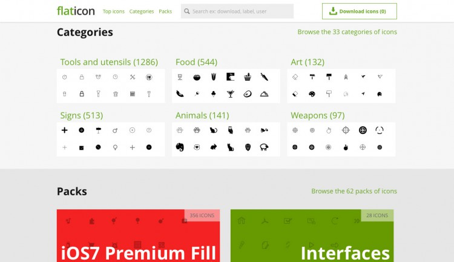
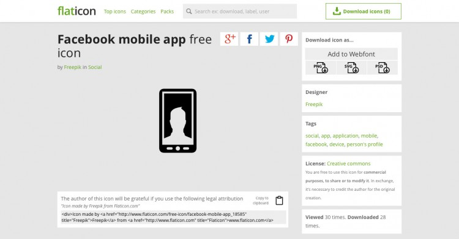

## Flat Design - was ist das?

Der aktuelle Trend heisst Flat Design und ist im Interface Design mittlerweile allgegenwärtig. Übersetzen kann man diese Stilrichtung mit "flache Gestaltung. Man ist davon weggekommen möglichst realistische Benutzeroberflächen zu schaffen und konzentriert sich auf das Minimum. Realistische Effekte wie Texturen, Schlagschatten und weiteren Details entfallen dadurch. Geschickt eingesetztes Flat Design kann eine effektivere Usability bewirken und ist geeigneter für responsive Gestaltung.

## Icon-Angebot auf flaticon.com

Die Anzahl an Icons, welche auf flaticon.com gefunden werden können, beträgt im Moment ca. 20’000. Die Icons richten sich an Flat Design Projekte und werden als Vektordaten angeboten. Somit können die Icons ganz einfach in Farbe und Grösse geändert werden.

## Tags, Kategorien und Packs

Da die die Auswahl riesig ist, helfen Kategorien, Tags und Packs für das Auffinden der gesuchten Icons. Wird das Suchfeld benutzt, helfen die Tags (Schlagwörter) die Icons zu beschreiben und beim zutreffenden Suchwort aufzulisten. Die Kategorien sind Oberbegriffe und fassen inhaltlich passende Icons zusammen. Die Packs sind Sammlungen eines Designers welche stilistisch und thematisch zusammengehören.

Die Detailansicht eines Icons beinhaltet die Angabe des Designer und der Lizenz mit dessen das Icon zur Verfügung gestellt wird.

## Webfont aus Auswahl erstellen

Vektordaten können durch ihre Skalierbarkeit als Font verwendet werden. Mithilfe von flaticons.com kann nebst dem PNG-, SVG- oder PSD-Format ein Webfont zusammengestellt werden. So können, nebst den üblichen Vorteilen von Vektordaten, auch die Ladezeiten verbessert werden.

