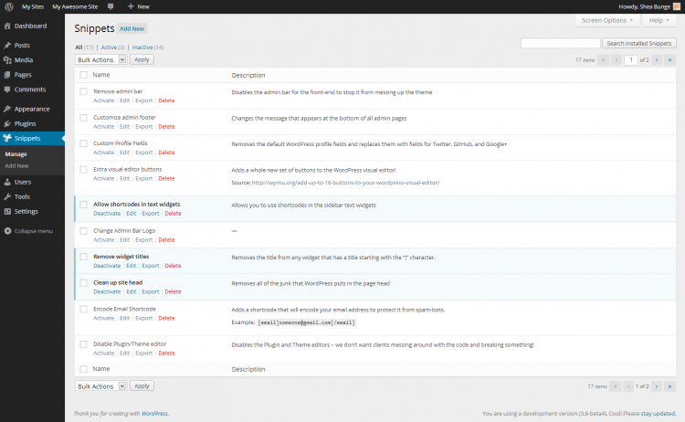

## Nachteile Themeordner

Googelt man nach einer Lösung wie man gewisse Abläufe in WordPress schneller und besser erledigen kann, stösst man immer wieder auf den Begriff _WordPress Snippets_. Man wird angewiesen ein Codeschnipsel in die _functions.php_ zu kopieren – et voilà – es funktioniert.

Dieses Vorgehen ist korrekt, lässt sich aber noch optimieren. Was geschieht nämlich wenn ihr euer Theme wechselt? Das Theme ist nicht mehr aktiv und daher auch das Snippet. Das Speichern in die _functions.php_ ist eine gute Lösung, wenn das Snippet explizit nur mit dem installierten Theme Sinn macht. Meistens ist das nicht der Fall. Am besten stellt ihr euch vor der Installation genau diese Frage: Benötige ich dieses Snippet auch noch wenn ich ein anderes Theme benutze?

Werden mehrere Codeschnipsel eingesetzt, kann der Überblick leicht verloren gehen. Wenn ihr zudem noch mehrere Blogs oder Websites mit denselben Snippets betreibt, leidet der Überblick noch mehr, wo was installiert wurde.

## Code Snippets Plugin

Um die oben genannte Nachteile auszumerzen, könnt ihr das [WordPress Plugin Code Snippets](http://wordpress.org/plugins/code-snippets/) einsetzen. Nach der Installation des Plugins erscheint im Hauptmenü links ein neuer Link mit dem Namen _Codeschnipsel_.

Nun habt ihr ein Werkzeug zur Hand, welches euch das Verwalten von Snippets mit gewohnter Benutzeroberfläche ermöglicht und vereinfacht.

Nachdem ihr ein Snippet hinzufügt, muss es noch aktiviert werden. Dies funktioniert auf dieselbe Weise wie ihr Plugins aktiviert/deaktiviert. Benötigt ihr ein Snippet einmal nicht mehr, wollt es jedoch noch nicht löschen, könnt ihr es deaktivieren.

### Exportieren & Importieren

Snippets lassen sich exportieren und importieren. Das Exportieren wird unter _Codeschnipsel – Verwalten_, das Importieren unter _Werkzeuge – Daten importieren – Codeschnipsel_ bewerkstelligt. Gerade bei WP User die mehrere Seiten betreiben, kann dies eine enorme Arbeitserleichterung sein.

### Fehlerhaftes Snippet

Wurde einmal ein fehlerhaftes Snippet aktiviert welches eure Website unbenutzbar macht, könnt ihr mithilfe der _wp-config.php_ in den Sicherheitsmodus wechseln. Fügt dabei die Zeile `define( 'CODE_SNIPPETS_SAFE_MODE', true );` in die _wp-config.php_. Nachdem das fehlerhafte Snippet gefunden und deaktiviert habt, könnt ihr den Sicherheitsmodus wieder ausschalten.

## Fazit

Natürlich könnte man mit jedem Snippet ein WordPress Plugin kreieren. Gerade für mehrere kleinere Snippets finde ich dies aber die elegantere Variante. Was denkt ihr?

