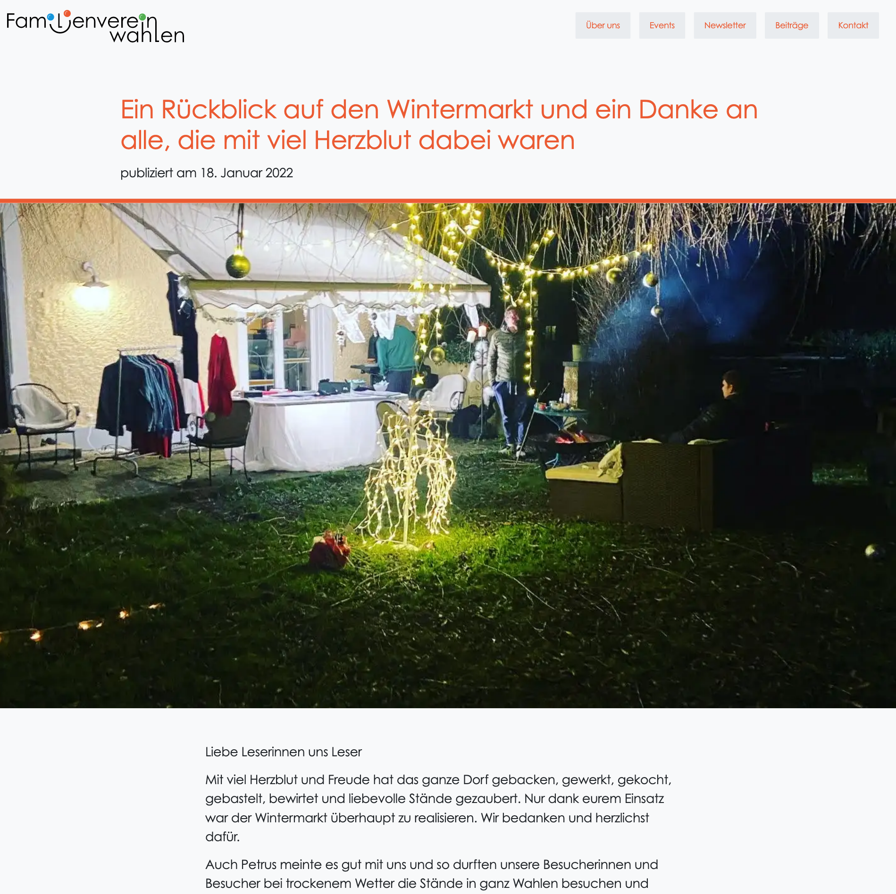
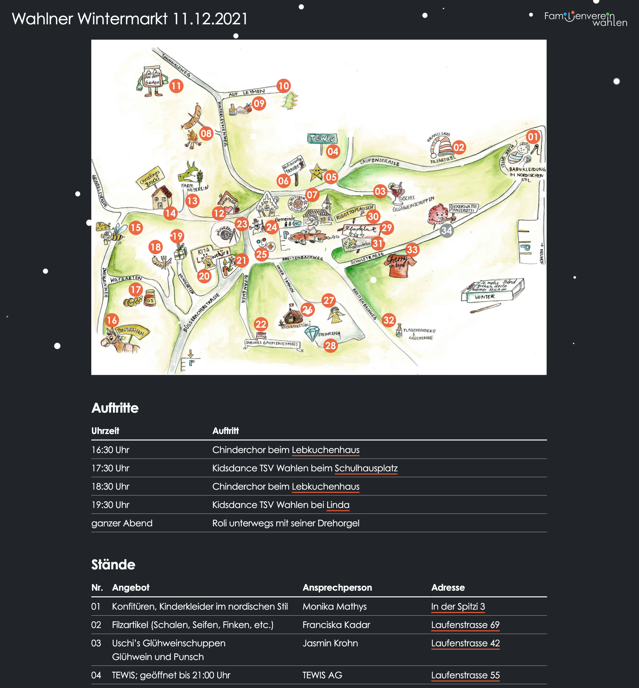
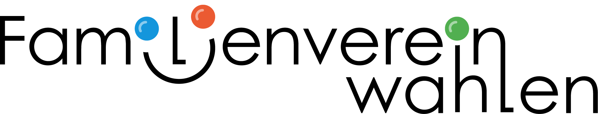

> [!info] Update 2.2.2024
> Seit Juni 2023 habe ich beide Tools abgelöst. Für die Website nutze ich Notion für die Inhaltsverwaltung, also als CMS-Backend. Für das Frontend, also die eigentlich Website-Auslieferung im Browser, wird dann 11ty genutzt. Mit [[notion2eleventy|notion2eleventy]] habe ich eine Schnittstelle der beiden Tools gebaut.

_Artikelansicht beginnend mit einem grossen Bild über die ganze Breite des Viewports._

### Wintermarkt

Im November 2021 organisierte der Verein einen gelungenen Wintermarkt im Dorf. Für diesen Anlass habe ich eine [Landingpage](https://familienverein-wahlen.ch/wahlner-wintermarkt) gemacht, die aus einer interaktiven Karte bestand. Mit Klick auf eine Nummer konnte der User erfahren, was der entsprechende Stand anbietet.

_Landing Page des Wintermarkt 2021. Animierte Karte ist verlinkt mit der Tabelle mit mehr Infos zum Stand. Die Seite wird mit einem Schneien-Effekt geschmückt._

## Logodesign

Bevor es zur Umsetzung der Website kam, konnte ich das Vereinslogo gestalten. Es verwendet den Font Century Gothic, einer serifenlosen Schrift mit hoher Mittellänge. Die Buchstaben i und l wurden zum einem Smile umgeformt und bunte Kugeln eingesetzt.

