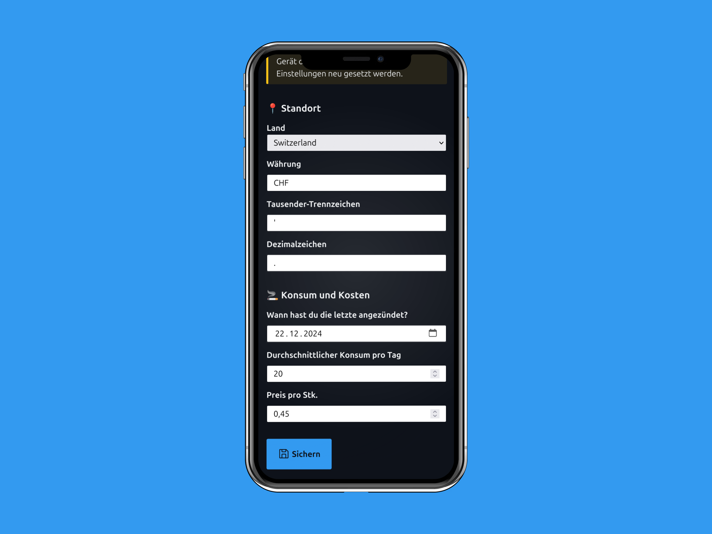

Am 22.12.2024 habe ich mit dem Rauchen aufgehört. Ein solches Vorhaben benötigt einiges an Motivation und Durchhaltevermögen. Die Verlockung bei Stress und Langweile ist auch heute – mehr als drei Monaten nach dem Stopp – noch gross. 

Wenn meine Gedanken wieder mal verrückt spielen und mich überreden möchten, werfe ich ein Blick in meine Rauchfrei App. Dann bin ich ein bisschen Stolz über den Fortschritt. Sei es über

- die wachsende Anzahl erreichter rauchfreier Tage, 
- das gesparte Geld oder 
- den erreichten Gesundheitslevel.

 Diesen Fortschritt möchte ich nicht zunichte machen.

## Individuelle Rauchfrei-Einstellungen

Die Web-App ist mit dem *Static Site Generator* [11ty](https://www.11ty.dev/) und mithilfe von ein paar netten Github-Repositories realisiert:

- [countries-states-cities-database](https://github.com/dr5hn/countries-states-cities-database)
- [decimal-point-and-thousand-separator](https://github.com/HthSolid/decimal-point-and-thousand-separator)

Die Daten der beiden Repos werden für eine lokalisierte Anzeige des Geldbetrags benötigt. In den persönlichen Einstellungen wird das gewünschte Land ausgewählt. Damit werden die Felder

- Währungskürzel
- Tausendertrennzeichen
- Dezimalzeichen (Punkt oder Komma)

automatisch abgefüllt.

### Konsum und Kosten berechnen

Um berechnen zu können wie lange man schon rauchfrei ist und wie viel Geld damit gespart wurde, benötigt es 

- den Stichtag seit dem nicht mehr geraucht wurde;
- die durchschnittlich konsumierte Anzahl Zigaretten (oder andere Rauchwaren); 
- sowie der Preis pro Stück.

## Persönliches Dashboard

Mit dem Speichern der persönlichen Einstellungen ergibt sich folgendes Dashboard:

Die ersten beiden Werte (Streak und der gesparte Betrag) sind vermutlich auf den ersten Blick selbst erklärend. Der Gesundheitslevel ist es nicht und verlinkt daher auf den Schlüssel was die einzelnen Stufen bedeuten.

## Lokale Datenspeicherung

Die persönlichen Daten werden lokal im *Local Storage* gespeichert. Sie verlassen den Browser demnach nicht. 

Die Kehrseite dieses (Datenschutz-)Vorteils ist, dass die wenigen Einstellungen verloren gehen, wenn die Browserdaten gelöscht werden. Sie sind in einem anderen Browser oder einem anderen Gerät nicht verfügbar und müssen erneut eingegeben.

Um diesen negativen Punkt etwas zu entschärfen, habe ich mir als mögliches zukünftiges Feature überlegt, dass die Einstellungen als JSON-Datei exportiert und wieder importiert werden können.
